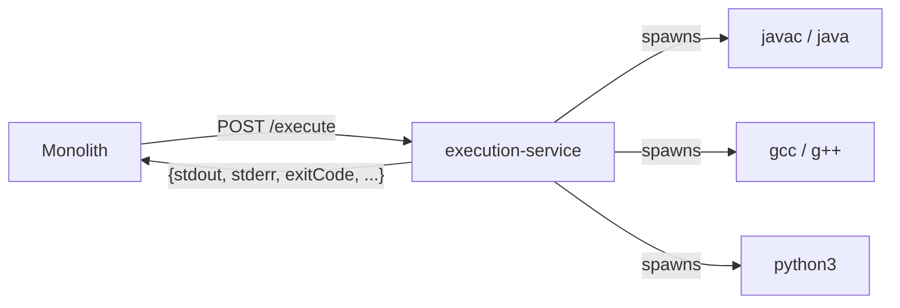

# execution-service


A sandboxed code execution microservice. It has no DB, no auth beyond one
shared API key on `/execute` and `/health/details`, and no idea what a
"problem" or "submission" is — it takes source + stdin and returns raw
output. A monolith calls it once per test case and does all judging itself.



Code runs directly in this container's own process — no per-request Docker
container is spawned. That keeps it light enough for a free-tier host, at
the cost of trusting the guards below to contain untrusted code.

## API

`POST /execute` and `GET /health/details` require `X-Internal-Api-Key`.
`GET /health` is public (liveness + resource snapshot) so uptime probes
do not need the key. Without a key, `/execute` is an open "run arbitrary
code for free" endpoint.

### `POST /execute`

```jsonc
// request
{
  "language": "python" | "java" | "cpp" | "c",
  "sourceCode": "string",   // full, already-wrapped source
  "stdin": "string",         // optional
  "timeoutMs": 5000           // optional, clamped server-side regardless
}
```

```jsonc
// response
{
  "stdout": "string",
  "stderr": "string",
  "exitCode": 0,             // number | null
  "timedOut": false,
  "compileError": "string",  // present only if compilation failed
  "runtimeMs": 42,             // run step only, excludes compile time
  "cacheHit": true             // omitted for python (no compile step)
}
```

### `GET /health`

Unauthenticated liveness. Always `200` if the process can answer. Does
not spawn compilers. Body includes service version, Node version, uptime,
process/system memory, optional cgroup memory (container cap), CPU core
count, 1/5/15m load averages, and a sampled CPU usage percent.

### `GET /health/details`

Requires `X-Internal-Api-Key`. Same snapshot as `/health`, plus toolchain
availability/versions (`python3`, `javac`/`java`, `gcc`/`g++`), execution
pool stats, and compile-cache size. Returns `503` if any required
toolchain is missing.

## Compile caching

Compiling on every test case is wasteful — a 10-test-case Java submission
would otherwise compile 10 times for identical source. Compiled artifacts
are cached by `sha256(language + sourceCode)`:

- Both outcomes are cached — a broken submission's `compileError` is
  replayed on repeat without recompiling.
- Concurrent requests for the same new hash share one in-flight compile;
  only the first triggers `javac`/`gcc`/`g++`, the rest await its result.
- Entries expire after an idle TTL (~15 min) and the cache is capped by
  count (~40 entries, LRU eviction) — this runs on a resource-constrained
  free-tier box.
- The cache is in-memory + local disk only, reset on every boot. Python has
  no compile step, so it always gets a fresh scratch dir instead.

## Process safety

- Every run has a hard timeout, enforced with `SIGKILL` against the whole
  process **group** (not just the top PID) — a runaway program that forks
  children doesn't leave orphans behind.
- The spawned process gets an environment **allowlist** (`PATH`, temp dirs,
  locale, `JAVA_HOME`) — this service's own env, including its API key,
  never reaches sandboxed code.
- C/C++/Python runs are capped with `ulimit -v`; Java is capped via `-Xmx`
  instead, since `ulimit -v` breaks JVM startup.
- A small in-process pool caps concurrent compiles/runs
  (`MAX_CONCURRENT_EXECUTIONS`) so a burst of requests can't OOM the
  container; once its queue is full, extra requests get `503`.

Not handled here (by design — see `## 8` of the spec this implements):
judging/verdicts, output sanitization, or filesystem/network sandboxing
beyond the temp/cache directories.

## Run locally

```
cp .env.example .env   # set EXECUTION_SERVICE_API_KEY
docker compose up --build
```

The image is `node:20-bookworm-slim` plus headless JDK 17, gcc, g++, and
python3 — no other runtime dependencies.
